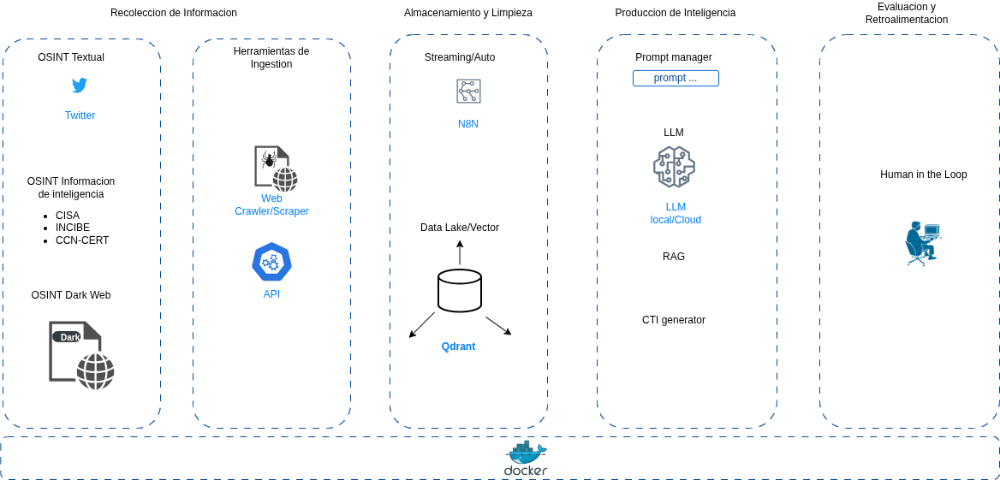

# OSINT-GenAI
Early Threat Detection using OSINT and Generative AI

#
#
# DESCRIPTION
OSINT-GenAI is an N8N that integrates different scrapping tools like CRAWL4AI, HTTP Request, Robin, to scrap OSINT information from X Twitter (Mandiant OR from:incibe_cert OR from:Threatlabz OR from:Unit42_Intel OR from:CISACyber), CISA, INCIBE-CERT, and use ROBIN to scrapping Darkweb.
#
#
# ARCHITECTURE

#
Architecture is containerized with Docker and use N8N as integration and automation orchestrator.
#
#
# OSINT-GenAI OSINT scrapping and ingestion video
Next screencast records OSINT information scrapping and normalization
#
](https://www.youtube.com/watch?v=WawByzvT_cM)
#
# OSINT-GenAI Embeddings and Vectorization for RAG
Next screencast records how to Qdrant tranforms markdown info in to vectors.
#
](https://www.youtube.com/watch?v=4unzFl6RgUQ)
#
# OSINT-GenAI Ciberthreat Intelligence Production
Next screencast records how to a general trained LLM like Mistral (but could be other like Ollama, Gemini, Claude etc) helps to respond questions about Threats and answer including TTPs, CVEs and IOCs.
#
](https://www.youtube.com/watch?v=XSayfnaYKeg)
#
